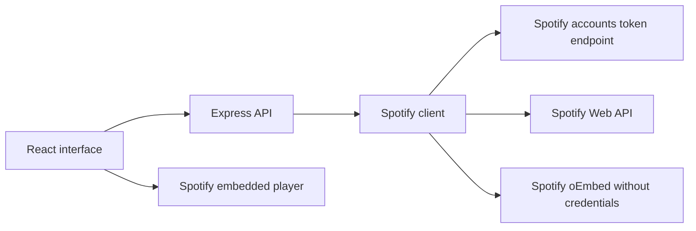

# Code guide

## Architecture

The React application calls same-origin `/api` routes. Express validates input and delegates music requests to a shared Spotify client. Credentials and access tokens stay on the server. Only the official Spotify iframe and remote Spotify artwork load directly in the browser. There is no database, user account system, favorites persistence, or Wikipedia/Apple/Last.fm fallback in this version.

## Server files

| File | Responsibility |
|---|---|
| `server/index.js` | Loads `.env`, reads the two Spotify credentials, chooses `PORT` (default 3006), and starts Express on all interfaces. |
| `server/app.js` | Creates the app, registers `/api` routes, validates IDs/query/country, converts errors to JSON, rejects unknown API paths, and serves `client/dist`. |
| `server/spotify.js` | Owns all Spotify network calls, token caching, a shared pending token request, ten-second request timeout, rate-limit cooldown, artist normalization, searches, discovery cache, and similarity scoring. |
| `server/genres.js` | Maps recognized genre aliases to simple labels such as Pop, Hip-Hop, R&B, House, EDM, and K-Pop. Unknown labels are omitted. Raw Spotify genres remain available for similarity scoring. |
| `server/app.test.js` | Mock-network Spotify tests plus HTTP route tests; verifies errors, credentials, identities, caching, recommendations, and validation. |
| `server/genres.test.js` | Verifies alias normalization, deduplication, and omission of unrecognized metadata. |
| `server/discovery.test.js` | Verifies shuffle behavior for large and small pools. |

### Spotify client functions

- `createSpotify(options)` accepts server credentials and an injectable fetch function for tests.
- `json()` applies timeouts, handles non-success responses, and respects a Spotify 429 cooldown. It does not return upstream error bodies to the browser.
- `accessToken()` uses client credentials, caches the token until shortly before expiry, and coalesces simultaneous token requests. Credentials are never included in API response objects.
- `api()` sends authorized requests to Spotify's fixed Web API host.
- `artist()` converts metadata into Ripple's common artist contract, preserving the Spotify ID and generating the official embed URL.
- `profile()` uses the artist API when configured, otherwise Spotify oEmbed for the supplied artist ID. There is no cross-provider identity guessing.
- `search()` requests up to ten artists in the selected market and accepts an internal offset for discovery.
- `discover()` searches eight broad/niche genres concurrently at varying offsets selected with Node crypto.randomInt, deduplicates by ID, and caches successful pools for five minutes per country (up to 20 cache entries).
- `related()` searches up to two raw genres, excludes the current artist, deduplicates candidates, ranks by exact shared-genre count, and returns up to six. This is Ripple's algorithm, not Spotify's Fans also like feed. With missing genres it uses the identity-verified Spotify search fallback described below.
- `songs()` converts up to ten Spotify track matches into titles, artist names, albums, and Spotify links.

## Frontend files

| File | Responsibility |
|---|---|
| `client/index.html` | HTML entry point, page title, viewport, theme color, and root element. |
| `client/src/main.jsx` | Mounts React; renders the Ripple brand, artist/song navigation, and footer. |
| `client/src/ArtistSearch.jsx` | Owns artist query, country, search results, selected profile, loading/errors, and back navigation. Cancels superseded requests and focuses the profile heading. |
| `client/src/ArtistPhoto.jsx` | Displays the Spotify image or initials when missing/broken. Supplies its source link to cards. |
| `client/src/ArtistPlayer.jsx` | Renders the artist iframe with an accessible title, reload button, and direct Spotify link. Spotify decides playable tracks; Ripple does not control or verify playback inside the cross-origin frame. |
| `client/src/Discovery.jsx` | Fetches the discovery pool; renders reusable `DiscoveryCard` components; changes the selection every ten seconds unless paused, interacting, or the tab is hidden. |
| `client/src/discovery-shuffle.js` | Pure Fisher–Yates shuffle using an injectable random function; prefers artists outside the previous selection and fills from it only when necessary. |
| `client/src/RelatedArtists.jsx` | Loads suggestions for the current artist and country; handles loading, retry, and empty states; reuses discovery cards. |
| `client/src/SongSearch.jsx` | Loads provider availability and submits song searches. Shows Spotify links, loading/errors, and no-result states. |
| `client/src/styles.css` | Dark/lime visual theme, responsive grids, search controls, artist banner, images, and embedded-player layout. Some legacy selectors remain unused. |
| `client/public/images/radiohead.jpg` | Legacy credited asset, not referenced by the current interface. |
| `client/vite.config.js` | React build configuration, frontend root, development host/port, and `/api` proxy to the backend `PORT`. |

## Configuration and repository files

| File | Responsibility |
|---|---|
| `package.json` | Runtime/development dependencies, Node minimum, and `dev`, `build`, `start`, `test` scripts. |
| `package-lock.json` | Reproducible dependency versions for `npm ci`; update through npm. |
| `.nvmrc` | Node 24 selection for compatible environments. |
| `.env.example` | Public template containing `PORT` and empty Spotify credential fields. |
| `.gitignore` | Excludes credentials, dependencies, generated builds, OS files, and logs. |
| `.github/workflows/trivy.yml` | Filesystem dependency scan on main pushes/PRs and manual runs; produces JSON, Markdown severity summary, version text, and an artifact. |
| `README.md` | Project entry point and links to this documentation. |
| `CREDITS.md` | Current Spotify attribution and legacy asset licensing. |
| `docs/*.md` | Maintained technical documentation. |
| Sprint PDFs and `sprint1-demo.mp4` | Historical coursework evidence, not application runtime inputs. |

## Safe extension points

Add genre aliases in `server/genres.js` with tests. Modify discovery query genres or ranking in `server/spotify.js`; keep claims about similarity and popularity consistent with actual inputs. Change layout in React components and CSS without exposing credentials. New persistence or login features require their own design and are not implemented by this update.

## Artist suggestions when genres are unavailable

If Spotify omits genres or genre matching produces no candidates, Ripple searches the current artist name, verifies that the exact Spotify ID appears, then displays up to six other unique artists returned by that search. The section is labeled “Other artists to explore” and explains the search-based source. This is not Spotify’s Fans also like feed and may be empty if the identity cannot be verified or no other matches exist. No additional provider is used. Homepage cards no longer show the generic “Discover on Spotify” badge; photo attribution links remain.
